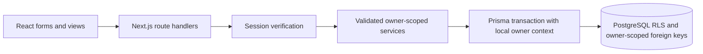

# Clearpath architecture and implementation plan

## Repository inspection

The provided workspace contained empty `outputs/` and `work/` directories. No existing application, Git checkout, package manifest, Prisma schema, or application-specific instructions were present to preserve. The delivered project is under `outputs/clearpath/`; temporary database files and package caches stay under `work/`.

Phases 1–8 are implemented: authentication/isolation, ledger, budgets, goals, recurring schedules, subscriptions, income planning, and retirement contribution API foundation. Phase 9 local security hardening and deployment documentation are implemented; public release gates remain in DEPLOYMENT.md.

## 1. Architecture

Phase 8 adds persisted onboarding and financial preferences (`PUT /api/onboarding`, `PUT /api/preferences`), retirement settings (`GET/PUT /api/retirement`), and revision-guarded contribution updates/deletes (`PUT/DELETE /api/retirement/contributions/[id]`). In-app notifications only display due schedules on Overview; no background email/push delivery is implied. Budget defaults are separate from roadmap savings assumptions. Export services use an explicit model allowlist and the owner lock/RLS boundary. CSV includes optional inclusive date bounds and formula-safe text; JSON exports the full workspace without authentication secrets. JSON is a versioned portable data export, not a tested restore mechanism. Exports are generated in memory and may require pagination/streaming before supporting very large workspaces.

Phase 7 adds read-only owner-scoped calendar and review services. Both take the same owner lock as ledger mutations. Calendar combines actual dated transactions, pending projections from active recurring schedules, and durable processed/skipped markers; it never posts entries during a read. Monthly review uses only actual ledger and retirement contribution records, saved budget allocations, and date-filtered goal contributions. Review data is calculated on demand rather than stored as immutable statements, so corrections are reflected immediately. Calendar projections and reconstructed goal opening amounts are explicitly labelled. The authenticated APIs are `/api/calendar` and `/api/review`, each accepting only an optional `month=YYYY-MM` query.

Phase 5 APIs: `GET/POST /api/recurring`, `PATCH /api/recurring` to run the current owner's automatic entries, and `GET/PUT/POST/DELETE /api/recurring/[id]`. PUT requires the current revision; POST accepts `{action: "post" | "skip", dueDate: "YYYY-MM-DD"}`. Plans with history must be deactivated rather than deleted. Income settings use `GET/PUT /api/income`; PUT includes `expectedRevision`, decimal-string `annualSalary` and `netPaycheck`, and `payFrequency`. Actual income remains an ordinary ledger entry, with optional gross/deduction values constrained to equal net. Retirement foundation uses `GET/POST /api/retirement/contributions`, with decimal-string `employee`, `employerMatch`, and `employerOther`, a past/current `date`, and optional notes. Its totals never increase spendable cash. Phase 8 now implements retirement settings and contribution editing/deletion with revision guards.

- Next.js App Router on the Node.js runtime, React, strict TypeScript.
- Tailwind CSS with shared, original forest-green/lime design tokens and accessible native form controls. Light, dark, and system appearances.
- PostgreSQL and Prisma. No browser database access. No browser persistence for financial data or sessions.
- Route handlers validate transport, sessions, and payloads; services implement business operations; Prisma accesses PostgreSQL.
- Pure finance functions use `bigint` cents. JSON represents money as decimal **strings of minor units**.
- Recharts 3.10.1 provides interactive analytics with exact-data tables. Chart coordinates use numbers; financial aggregates and displayed money retain bigint cents.
- Bank integrations are not implemented. Future adapters must create validated ledger transactions through the same service, using an external identity/idempotency mapping.
- The requested PostgreSQL/Node architecture is retained rather than adapting this Phase 1 foundation to an edge database. Public hosting is deferred until the full application and deployment review are complete.

## 2. Database design

The executable schema is `prisma/schema.prisma`. The committed initial migration includes PostgreSQL policies, checks, and contribution triggers from `prisma/security.sql`. Changes after this baseline should use additional migrations, not edit an applied migration.

| Model | Responsibility and constraints |
|---|---|
| User | Canonical lowercase unique email, name, salted password hash, timestamps. |
| Session | HMAC digest of a random 256-bit token, owner, fixed seven-day expiry. Raw token exists only in the secure cookie. |
| PasswordResetToken | Single-use digest, 30-minute expiry, owner. Email delivery adapter required. |
| AuthRateLimit | Shared, atomic database attempt counts by HMAC-protected bucket. |
| UserSettings | Exactly one settings row per user; USD, theme, time zone, onboarding and preference defaults. |
| Account | Owner, type, name, signed opening balance, currency, institution, description, archive flag. Balance is derived, never independently edited. |
| Category | Owner-scoped unique name, icon, archive flag; optional subcategories can follow without changing transaction ownership. |
| Transaction | Positive amount, date-only accounting date, income/expense/transfer/savings-transfer type, source account, optional destination, category, notes, recurring occurrence key. |
| MonthlyBudget | One first-of-month row per user/month; planned net income and cash savings. |
| BudgetItem | One category allocation per monthly budget; nonnegative amount, recurring flag. |
| SavingsGoal | Nullable target only for paused goals, explicit starting allocation, planned contribution, status, priority, target date, optional account. |
| GoalContribution | One goal assignment per savings-transfer transaction. No duplicated contribution amount. |
| RecurringTransaction | Frequency, next due date, amount, account, category, active/auto-create/reminder mode, subscription flag. |
| RetirementSettings | Salary in cents, percentages in integer basis points, explicit employer fields defaulting to zero, current balance. |
| AccountBalanceSnapshot | Derived account/day snapshot; transactions remain authoritative. |

All financial tables contain `userId` and enable **FORCE ROW LEVEL SECURITY**. Child rows whose ownership flows through a parent use composite `(parentId, userId)` foreign keys. Parents have unique `(id, userId)` keys. This prevents a user-owned transaction from referencing someone else's account or category, even if application validation is accidentally omitted.

RLS policies require `userId = current_setting('app.user_id', true)`. Missing/empty context sees no records and cannot insert. `withOwner` sets this context with `set_config(..., true)` inside the same Prisma transaction as the queries. The setting cannot leak across pooled transactions. Explicit service filters provide another layer.

The runtime database role must be non-superuser, non-owner, and `NOBYPASSRLS`. Authentication tables are accessed by trusted auth services; they do not use financial owner policies because authentication precedes owner identification. They are never exposed as generic record APIs. A privileged migration connection is separate and never used by runtime code.

Deleting a transaction cascades its goal assignment. Accounts/categories/goals referenced by historical records are restricted; account/category UI offers archiving. Deleting a budget cascades its items. Full user deletion needs an explicit ordered, authenticated workflow and is not exposed.

Phase 5 adds recurring transfer destinations and goal assignment, occurrence tombstones, income settings, optional gross income/deductions, and a separate retirement contribution ledger. Dated opening balances and import/provider identities remain future work.

## 3. Page and route structure

| Route | Phase / behavior |
|---|---|
| `/` | Phase 1: routes to protected dashboard, then sign-in if needed. |
| `/signup`, `/login` | Phase 1: validated account creation and sign-in. |
| `/forgot-password` | Phase 1: truthful recovery availability notice. No simulated email success. |
| `/reset-password` | Planned after a trusted delivery provider is connected; tested server reset service already exists. |
| `/dashboard` | Phase 2: current balances, monthly ledger totals, recent activity, month selector. Phase 6 adds compact trend/category charts and links to analytics. |
| `/settings` | Phase 1: profile name, theme, time zone, password change, logout. |
| `/onboarding` | Add income, accounts, monthly budget, first goal as their services ship; optional skip. |
| `/accounts`, `/categories`, `/transactions` | Phase 2: implemented CRUD/archive, balances, quick add, search/filter/sort/pagination. |
| `/budget` | Phase 3 implemented: month picker, plan editing, budget-versus-actual comparison, category drill-down, and copy prior month. |
| `/goals`, `/goals/roadmap` | Phase 4 implemented: goal CRUD, contribution entry/history, individual projections, shared sequential roadmap and ordering. |
| `/recurring`, `/income` | Phase 5. |
| `/analytics` | Phase 6. |
| `/calendar`, `/review` | Phase 7. |
| `/retirement` and expanded `/settings` | Phases 5–8. |

Only implemented routes appear in navigation. No inactive buttons pretend to provide future features. Each protected page verifies its own session in addition to the protected layout; each API independently verifies the session.

## 4. Component structure

Implemented: `Brand`, `AuthFrame`, `AuthForm`, `WorkspaceNav`, `Logout`, `ProfileForm`, `PreferencesForm`, `PasswordForm`, `AccountManager`, `CategoryManager`, `TransactionForm`, `AddTransaction`, `TransactionFilters`, `TransactionList`, `Modal`, `RecordActions`, loading/error states, shared CSS tokens.

Planned: chart/comparison components, `BudgetCategoryCard`, `GoalCard`, `GoalProjection`, `GoalRoadmap`, `RecurringItem`, `FinancialCalendar`, `ChartFrame`, `MonthlyReview`. Components consume server-derived DTOs and shared finance utilities.

Desktop gets a sidebar. Mobile currently has bottom navigation and single-column forms; later pages use transaction cards instead of compressed tables. Labels, visible focus states, reduced-motion support, text status labels, and live error/success announcements are included.

## 5. Backend and APIs

Implemented endpoints:

| Method and path | Behavior |
|---|---|
| `POST /api/auth/register` | Name/email/password/confirmation; atomic user + empty settings + session. |
| `POST /api/auth/login` | Generic invalid credentials response; issues a fresh session. |
| `POST /api/auth/logout` | Revokes this session and expires cookie. |
| `POST /api/auth/change-password` | Requires current password; revokes all old sessions and reset tokens; rotates current session. |
| `GET /api/profile` | Safe own-user fields only. |
| `PATCH /api/profile` | Own name only; strict schema rejects injected `userId`. |
| `GET /api/workspace/:resource` | Own records, capped at 100 except single-row settings. |
| `GET /api/workspace/:resource/:id` | Own record or generic 404. |
| `PATCH /api/workspace/:resource/:id` | Legacy path: account/transaction edits delegate to the ledger service; budgets/goals/settings retain narrow foundation fields. |
| `DELETE /api/workspace/:resource/:id` | Owner-scoped deletion; settings cannot be deleted. Referenced records are protected by foreign keys. |

The resource allowlist is `accounts`, `transactions`, `budgets`, `goals`, `settings`. These security foundation endpoints are tested before financial creation flows. They are not the final comprehensive finance API. There is intentionally no browser-supplied owner argument. Foreign and nonexistent IDs return the same 404 status/body for reads, writes, and deletes.

Phase 2 adds `GET/POST /api/ledger/:resource` and `GET/PATCH/DELETE /api/ledger/:resource/:id` for accounts, categories, and transactions. `src/server/ledger.ts` validates references under owner context, serializes reads and mutations against the owner row, and performs all transfer changes in one database transaction. Transactions have a per-owner unique UUID client request key: identical retries return the same row; changed payloads conflict. Balances and cash-flow formulas share `src/lib/finance.ts`. Derived snapshots are invalidated on ledger/opening-balance changes. Search verifies owner-owned filter IDs and uses stable 25-row pagination. Recent-category defaults come from the owner's active expense history, never shared browser storage.

Phase 3 adds `GET/PUT /api/budgets/:month` and `POST /api/budgets/:month/copy`. `src/server/budgets.ts` loads category expense aggregates for an inclusive-start/exclusive-end calendar month. Planned amounts and actual ledger results remain separate. Uncategorized/unallocated expenses count in spending. Whole-plan saves validate category ownership and archive status, check a monotonically increasing timestamp revision, and replace items in the same transaction. Copy only inserts into a month without a plan, preserves income/savings and selected active allocations, and never touches ledger records. Recurring budget-item flags are manual copy selectors; they do not post transactions. Legacy budget mutations also acquire the shared owner lock and invalidate editor revisions.

Budget UI components: `BudgetActions`, `BudgetEditor`, `CopyBudget`, shared `MonthToolbar`, and the overview's `BudgetSnapshot`. Domain DTOs, validation, and planning/date helpers live in `src/lib/budget.ts`. No schema change was necessary for this phase.

Phase 4 adds goal CRUD/list, ordering, and roadmap-assumption endpoints. `src/server/goals.ts` validates target/account/status/ownership/revisions and returns serialized progress/projection DTOs. `src/server/goal-links.ts` is shared by ledger mutations to validate assignments and refresh automatic completion status. A contribution stores no independent amount: the linked savings-transfer amount remains authoritative. Goal edits and contribution mutations invalidate goal-editor revisions. Goal-linked transfer edits/deletes/reassignments update status atomically under the same owner lock. Paused status is preserved; completed goals reopen when progress falls below the target. Existing database uniqueness and type triggers continue to protect the contribution relationship.

`src/lib/goals.ts` centralizes validation, monthly anniversary/date clamping, required contribution, and sequential roadmap calculations. Individual projections use each goal's planned contribution; the roadmap uses one shared amount stored in `UserSettings.defaultSavingsMinor`, sums remaining active goals in priority order, and carries the final month's surplus forward. All monetary arithmetic remains bigint. UI components are `GoalManager`, `GoalEditor`, `GoalRoadmap`, and the reused transaction dialog. Goal history uses the owner-validated `goal` transaction filter. No migration was required.

Recurrence generation is implemented with durable `(recurringId, date)` occurrence records, owner locks, and per-occurrence transactions. A Node instrumentation worker runs every minute with a 100-occurrence limit per owner per pass. Production explicitly opts in on a continuously running Node host. Phase 8 implements private CSV/JSON exports; import/restore remains future work.

## 6. Authentication and security

- Node's cryptographic `scrypt` with per-password 128-bit random salt, N=32768/r=8/p=3, 64-byte derived key; timing-safe comparison. Passwords are 12–128 characters. Incorrect/nonexistent users both perform expensive verification.
- Random 256-bit session token; HMAC-SHA256 digest at rest using `AUTH_SECRET`. Production cookie uses `__Host-` prefix, `HttpOnly`, `Secure`, `SameSite=Lax`, `Path=/`. Local HTTP uses an unprefixed development cookie.
- Server-side seven-day expiration and immediate logout/password-change/reset revocation.
- Password changes, reset consumption, and login synchronize on the user row to avoid stale-password session issuance. Reset token consumption is single-use under concurrent requests.
- Origin is compared against configured `APP_ORIGIN`, not a forwarded host. Mutations reject missing/wrong origins and cross-site fetches. JSON-only parsing and a streaming 16 KiB limit protect request handling.
- Database rate limiting: per-email login 10/15min; registration 5/15min; password changes 5/15min; reset 3/15min; global auth bounds. Deployment should add trusted edge IP throttling/abuse controls; no untrusted `X-Forwarded-For` reliance.
- Server-only module boundaries, parameterized Prisma/SQL, strict validation, no raw database error responses, no sensitive logs, private no-store API responses.
- Security headers include frame denial, nosniff, referrer/permission restrictions, CSP, and production HSTS. Per-request nonces and strict-dynamic protect scripts; production excludes unsafe-eval. Inline styles remain allowed for chart/layout compatibility. Deployment-specific TLS and browser verification remain before public release.
- No email verification/MFA yet. Reset delivery is not configured and no public reset endpoint falsely reports email delivery.

## 7. Financial rules

1. Store/calculations: `bigint` minor units, USD initially. Parse decimal input as strings. No floating-point money storage/arithmetic. Percentages use integer basis points; chart ratios may convert only after accounting calculations.
2. Income: only `INCOME` transactions, with amount equal to actual **net** cash received. Annual salary/gross income is informational, not spendable cash.
3. Expense: only `EXPENSE`. Transfers and savings transfers are excluded from consumer spending.
4. Balance: signed opening balance + income to account − expenses from account − outgoing transfers + incoming transfers. A credit liability is negative. Total cash excludes investments/credit; net worth is a separate measure.
5. Savings: explicitly marked `SAVINGS_TRANSFER`, counted once. An ordinary transfer never silently becomes savings. A future withdrawal policy must distinguish reversing savings from ordinary spending; do not double count account movement.
6. Actual cash flow: net income − actual expenses − cash savings. Net wealth movement and spendable cash flow are different outputs.
7. Remaining budget: planned net income − actual expenses − planned cash savings, per the request. Category remainder = category allocation − actual category expense. Negative values remain visible.
8. Savings rate: cash savings / actual net income. Zero income yields unavailable, not an invented zero percentage. Retirement excluded.
9. Goal progress: explicit opening allocation + amounts of linked, verified savings transactions. The opening allocation acknowledges preexisting savings without inventing historical transactions. No account inflow or goal balance is updated twice.
10. Goal projection: ceiling(remaining / planned monthly contribution). Zero contribution gives no estimate. Target-date required contribution rounds up to the nearest cent. Sequential roadmap uses cumulative remaining balances by active priority; paused goals do not consume contributions.
11. Calendar grouping: transaction dates and budget month are PostgreSQL DATE; selected calendar months use inclusive start/exclusive next-month boundaries. User time zone is applied only when turning timestamps into dates, not by reinterpreting stored date-only fields.
12. Retirement: employee salary × basis points / 10000, kept outside cash savings. Employer match/contribution defaults to zero and is never assumed. Actual YTD requires the later contribution ledger.
13. Snapshots/charts: derived from the authoritative ledger; backdated edits require rebuilding affected snapshots. Existing transactions must not be silently rewritten by budget copies or recurring-plan edits.

## 8. Development phases and exit criteria

Every phase: run the application, lint, strict TypeScript, relevant automated tests, and fix failures before proceeding.

| Phase | Deliverable | Critical acceptance checks |
|---|---|---|
| 1 | Project, database, authentication, isolation, private workspace/settings | Empty registrations; two-user API read/update/delete isolation; direct RLS; scoped relationships; session/CSRF/reset tests. |
| 2 | Accounts, categories, transactions, quick add, search/filter, first onboarding steps | Atomic transfers; no cross-owner references; transaction reversals; cent-safe balances; mobile entry. |
| 3 | Monthly budgets, budget/actual, category drill-down, copy prior month | Copy idempotency; historical month independence; expenses-only actuals; over-budget states. |
| 4 | Goals, contributions, projections, sequential roadmap | One authoritative contribution; no double counting; dates/priority/paused/complete behavior. |
| 5 | Recurrence, subscriptions, income, retirement ledger foundation | Idempotent generation; leap/month-end scheduling; no assumed employer match; net-income budgets. |
| 6 | Real dashboard, Recharts analytics, account history | Consistent centralized totals, range boundaries, empty/zero income states, responsive charts. |
| 7 | Calendar and monthly review | Bills vs actuals distinct; factual comparisons; historical review reproducibility. |
| 8 | Full onboarding, preferences, CSV/JSON exports, retirement UI, polish | Owner-only exports; CSV formula-injection mitigation; accessible responsive interactions; dark mode. |
| 9 | Full security review, integration/end-to-end coverage, deployment | Production role verification, nonce CSP, email/verification, abuse protection, migrations/backups/restores, dependency checks. |

Optional development seed data will be introduced as an explicit, owner-specific demo command in later phases. Registration must never invoke it. Phase 1 includes synthetic test fixtures only, isolated in a dedicated test database.

## References

- [Next.js authentication guide](https://nextjs.org/docs/app/guides/authentication)
- [Prisma multi-field relations](https://docs.prisma.io/docs/orm/prisma-schema/data-model/relations/one-to-many-relations)
- [PostgreSQL row security](https://www.postgresql.org/docs/current/ddl-rowsecurity.html)

These inform the session/service boundaries and database constraints; tests verify this project's concrete implementation.
